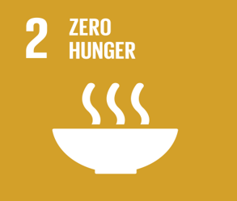
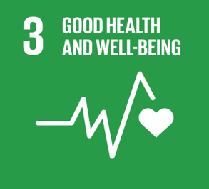
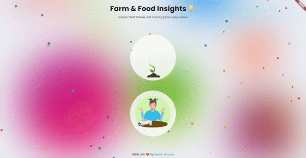
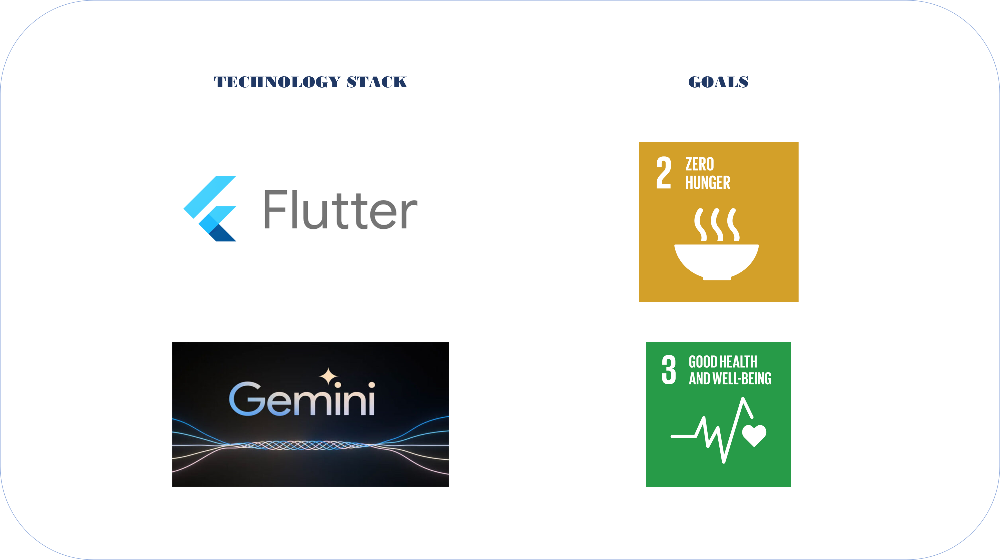

# **Introduction** 🌍
Farm and Food is a cutting-edge mobile application designed to empower users with insightful analysis of their food choices and their farms. Leveraging advanced and powerful Gemini models, Farm and Food offers a seamless way to understand the nutritional content, overall quality of meals while providing vital insights into crop health and sustainable agricultural practices.

Key Functions:

At its core, the app focuses on two main functions:

    Food Hygiene Analysis
    Crop Health Analysis

1. **Food Hygiene 🍽️ Analysis**: Your ultimate companion for making informed food choices.

    Make healthier choices by receiving recommendations from food menu lists.

    Identify food items rich in vitamins, proteins, and nutrients.

    Assess the hygiene levels of food items and discover healthy alternatives if available.

All this is possible with a snap of an image. The powerful Gemini Models analyze the food, ensuring healthy lives and promoting well-being for all ages. This feature helps combat malnutrition and food intolerance, addressing critical health issues faced globally.

2. **Crop Health 🪴 Analysis**: Essential for maintaining and improving farm health.

    Take control of your farm by understanding various disease conditions and their causes.

    Receive sustainable recommendations for curing diseases and promoting sustainable agriculture, along with preventive measures.

    Get tips for maintaining healthy crops, thereby enhancing food security.

This feature supports green agriculture and can also be applied to gardens and mini-vegetable farms on terraces.

  

  <strong>Aligned with the Sustainable Development Goals</strong>

Farm and Food aligns with the United Nations' Sustainable Development Goals (SDGs), particularly SDG 2 and SDG 3:

  

    

  <em>Achieve food security and promote sustainable agriculture.</em>

- The app tackles global malnutrition by enabling users to make healthier food choices, thereby improving nutrition.
- By providing insights into crop health and sustainable farming practices, it promotes food security and sustainable agriculture.
    

  

  <em>Ensure healthy lives and promote well-being for all at all ages.</em>

    
- The app’s focus on food hygiene and nutritional analysis ensures that users can make informed decisions that promote overall health and well-being.
- By addressing food intolerance and promoting balanced diets, it contributes to the prevention of diet-related health issues.

**Socio-Economic Impact**:
- By empowering individuals with the knowledge to choose healthier foods and maintain healthy crops, the app contributes to reducing healthcare costs associated with poor diet and malnutrition.
- Promoting sustainable agricultural practices helps smallholder farmers increase productivity and profitability, fostering economic growth in rural areas.

**Geographical Impact**:
- The app’s ability to analyze food and crop health is valuable across diverse geographical regions, from urban settings with mini-gardens to rural areas with extensive farmland.
- By providing tailored tips and recommendations, it helps users adapt to local agricultural conditions and challenges, supporting global efforts to enhance food security.

Farm and Food is more than an app; it is a movement towards healthier living and sustainable farming. Join us in making informed choices for our planet.

# Demo Video 📹

# How to Use ⬇️
Android App: 
 - Download APK file from [here](https://drive.google.com/file/d/1prWLfSYWOanH3GrbCTX_ePK9hZ0mG4Yn/view?usp=sharing).
 - Run the APK file in mobile. 

# About ⚙️

# In Action ⚒️

